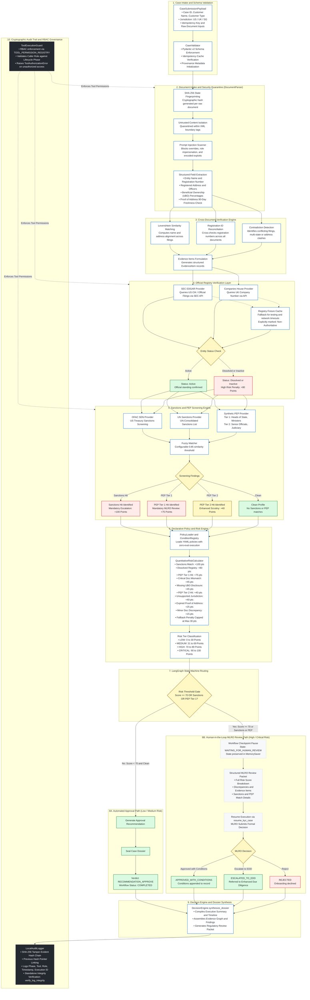

# Global KYC Compliance Agent — Technical Architecture & Workflow

```mermaid
flowchart TD
    %% ─────────────────────────────────────────────
    %% 1. CASE INTAKE & SCHEMA VALIDATION
    %% ─────────────────────────────────────────────
    subgraph INTAKE ["1. Case Intake and Schema Validation"]
        IN1["CaseSubmissionPayload<br/>• Case ID, Customer Name, Customer Type<br/>• Jurisdiction: US / UK / SG<br/>• Idempotency Key and Raw Document Inputs"]
        IN2["CaseValidator<br/>• Pydantic v2 Schema Enforcement<br/>• Idempotency Cache Verification<br/>• Provenance Metadata Initialization"]
    end

    %% ─────────────────────────────────────────────
    %% 2. DOCUMENT INTAKE & SECURITY DEFENSE
    %% ─────────────────────────────────────────────
    subgraph DOC_ENGINE ["2. Document Intake and Security Quarantine (DocumentParser)"]
        DOC1["SHA-256 State Fingerprinting<br/>Cryptographic hash generated per raw document"]
        DOC2["Untrusted Content Isolation<br/>Quarantined within XML boundary tags"]
        DOC3["Prompt Injection Scanner<br/>Blocks overrides, role impersonation, and encoded exploits"]
        DOC4["Structured Field Extraction<br/>• Entity Name and Registration Number<br/>• Registered Address and Officers<br/>• Beneficial Ownership (UBO) Percentages<br/>• Proof of Address 90-Day Freshness Check"]
    end

    %% ─────────────────────────────────────────────
    %% 3. CROSS-DOCUMENT VERIFICATION ENGINE
    %% ─────────────────────────────────────────────
    subgraph CROSS_DOC ["3. Cross-Document Verification Engine"]
        CD1["Levenshtein Similarity Matching<br/>Computes name and address alignment across filings"]
        CD2["Registration ID Reconciliation<br/>Cross-checks registration numbers across all documents"]
        CD3["Contradiction Detection<br/>Identifies conflicting filings, multi-state or address clashes"]
        CD4["Evidence Items Formulation<br/>Generates structured EvidenceItem records"]
    end

    %% ─────────────────────────────────────────────
    %% 4. OFFICIAL REGISTRY VERIFICATION
    %% ─────────────────────────────────────────────
    subgraph REGISTRY ["4. Official Registry Verification Layer"]
        REG_SEC["SEC EDGAR Provider<br/>Queries US CIK / Official Filings via SEC API"]
        REG_CH["Companies House Provider<br/>Queries UK Company Number via API"]
        REG_CACHE["Registry Fixture Cache<br/>Fallback for testing and network timeouts<br/>Explicitly marked: Non-Authoritative"]
        REG_STATUS{"Entity Status Check"}
        REG_ACTIVE["Status: Active<br/>Official standing confirmed"]
        REG_DISSOLVED["Status: Dissolved or Inactive<br/>High Risk Penalty: +80 Points"]
    end

    %% ─────────────────────────────────────────────
    %% 5. SANCTIONS & PEP SCREENING
    %% ─────────────────────────────────────────────
    subgraph SCREENING ["5. Sanctions and PEP Screening Engine"]
        SANC_OFAC["OFAC SDN Provider<br/>US Treasury Sanctions Screening"]
        SANC_UN["UN Sanctions Provider<br/>UN Consolidated Sanctions List"]
        SANC_PEP["Synthetic PEP Provider<br/>Tier 1: Heads of State, Ministers<br/>Tier 2: Senior Officials, Judiciary"]
        SANC_FUZZY["Fuzzy Matcher<br/>Configurable 0.85 similarity threshold"]
        SANC_EVAL{"Screening Findings"}
        SANC_HIT["Sanctions Hit Identified<br/>Mandatory Escalation: +100 Points"]
        PEP_T1["PEP Tier 1 Hit Identified<br/>Mandatory MLRO Review: +75 Points"]
        PEP_T2["PEP Tier 2 Hit Identified<br/>Enhanced Scrutiny: +40 Points"]
        SANC_CLEAN["Clean Profile<br/>No Sanctions or PEP matches"]
    end

    %% ─────────────────────────────────────────────
    %% 6. DECLARATIVE POLICY & RISK ENGINE
    %% ─────────────────────────────────────────────
    subgraph POLICY_ENGINE ["6. Declarative Policy and Risk Engine"]
        POL_LOAD["PolicyLoader and ConditionRegistry<br/>Loads YAML policies with zero-eval execution"]
        RISK_MATH["QuantitativeRiskCalculator<br/>• Sanctions Match: +100 pts<br/>• Dissolved Registry: +80 pts<br/>• PEP Tier 1 Hit: +75 pts<br/>• Critical Doc Mismatch: +45 pts<br/>• Missing UBO Disclosure: +45 pts<br/>• PEP Tier 2 Hit: +40 pts<br/>• Unsupported Jurisdiction: +40 pts<br/>• Expired Proof of Address: +25 pts<br/>• Minor Doc Discrepancy: +15 pts<br/>• Fallback Penalty Capped at Max 30 pts"]
        RISK_TIER["Risk Tier Classification<br/>• LOW: 0 to 30 Points<br/>• MEDIUM: 31 to 69 Points<br/>• HIGH: 70 to 89 Points<br/>• CRITICAL: 90 to 100 Points"]
    end

    %% ─────────────────────────────────────────────
    %% 7. ORCHESTRATION & ROUTING
    %% ─────────────────────────────────────────────
    subgraph ROUTING ["7. LangGraph State Machine Routing"]
        GATE{"Risk Threshold Gate<br/>Score >= 70 OR Sanctions OR PEP Tier 1?"}
    end

    %% ─────────────────────────────────────────────
    %% 8A. AUTOMATED PATH
    %% ─────────────────────────────────────────────
    subgraph PATH_AUTO ["8A. Automated Approval Path (Low / Medium Risk)"]
        AUTO_1["Generate Approval Recommendation"]
        AUTO_2["Seal Case Dossier"]
        AUTO_3["Verdict: RECOMMENDATION_APPROVE<br/>Workflow Status: COMPLETED"]
    end

    %% ─────────────────────────────────────────────
    %% 8B. HUMAN-IN-THE-LOOP PATH
    %% ─────────────────────────────────────────────
    subgraph PATH_HITL ["8B. Human-in-the-Loop MLRO Review Path (High / Critical Risk)"]
        HITL_1["Workflow Checkpoint Pause<br/>State: WAITING_FOR_HUMAN_REVIEW<br/>State preserved in MemorySaver"]
        HITL_2["Structured MLRO Review Packet<br/>• Full Risk Score Breakdown<br/>• Discrepancies and Evidence Items<br/>• Sanctions and PEP Match Details"]
        HITL_3["Resume Execution via resume_kyc_case<br/>MLRO Submits Formal Decision"]
        HITL_DEC{"MLRO Decision"}
        DEC_1["APPROVED_WITH_CONDITIONS<br/>Conditions appended to record"]
        DEC_2["ESCALATED_TO_EDD<br/>Referred to Enhanced Due Diligence"]
        DEC_3["REJECTED<br/>Onboarding declined"]
    end

    %% ─────────────────────────────────────────────
    %% 9. DOSSIER SYNTHESIS
    %% ─────────────────────────────────────────────
    subgraph SYNTHESIS ["9. Decision Engine and Dossier Synthesis"]
        DOSSIER["DecisionEngine.synthesize_dossier<br/>• Compiles Executive Summary and Timeline<br/>• Assembles Evidence Graph and Findings<br/>• Generates Regulatory Review Packet"]
    end

    %% ─────────────────────────────────────────────
    %% 10. AUDIT TRAIL & GOVERNANCE
    %% ─────────────────────────────────────────────
    subgraph GOVERNANCE ["10. Cryptographic Audit Trail and RBAC Governance"]
        AUDIT["LocalAuditLogger<br/>• SHA-256 Tamper-Evident Hash Chain<br/>• Previous Hash Pointer Linking<br/>• Logs Phase, Tool, Role, Timestamp, Execution ID<br/>• Standalone Integrity Verification: verify_log_integrity"]
        RBAC["ToolExecutionGuard<br/>• RBAC enforcement via TOOL_PERMISSION_REGISTRY<br/>• Validates Caller Role against Lifecycle Phase<br/>• Raises ToolAuthorizationError on unauthorized access"]
    end

    %% ─────────────────────────────────────────────
    %% CONNECTIONS (EXPLICIT FOR GITHUB COMPLIANCE)
    %% ─────────────────────────────────────────────
    IN1 --> IN2
    IN2 --> DOC1
    DOC1 --> DOC2
    DOC2 --> DOC3
    DOC3 --> DOC4
    DOC4 --> CD1
    DOC4 --> CD2
    DOC4 --> CD3
    CD1 --> CD4
    CD2 --> CD4
    CD3 --> CD4

    CD4 --> REG_SEC
    CD4 --> REG_CH
    REG_SEC -.-> REG_CACHE
    REG_CH -.-> REG_CACHE
    REG_SEC --> REG_STATUS
    REG_CH --> REG_STATUS
    REG_CACHE --> REG_STATUS

    REG_STATUS -->|"Active"| REG_ACTIVE
    REG_STATUS -->|"Dissolved or Inactive"| REG_DISSOLVED

    REG_ACTIVE --> SANC_OFAC
    REG_ACTIVE --> SANC_UN
    REG_ACTIVE --> SANC_PEP
    REG_DISSOLVED --> SANC_OFAC
    REG_DISSOLVED --> SANC_UN
    REG_DISSOLVED --> SANC_PEP

    SANC_OFAC --> SANC_FUZZY
    SANC_UN --> SANC_FUZZY
    SANC_PEP --> SANC_FUZZY
    SANC_FUZZY --> SANC_EVAL

    SANC_EVAL -->|"Sanctions Hit"| SANC_HIT
    SANC_EVAL -->|"PEP Tier 1"| PEP_T1
    SANC_EVAL -->|"PEP Tier 2"| PEP_T2
    SANC_EVAL -->|"Clean"| SANC_CLEAN

    SANC_HIT --> POL_LOAD
    PEP_T1 --> POL_LOAD
    PEP_T2 --> POL_LOAD
    SANC_CLEAN --> POL_LOAD

    POL_LOAD --> RISK_MATH
    RISK_MATH --> RISK_TIER
    RISK_TIER --> GATE

    GATE -->|"No: Score < 70 and Clean"| AUTO_1
    AUTO_1 --> AUTO_2
    AUTO_2 --> AUTO_3
    AUTO_3 --> DOSSIER

    GATE -->|"Yes: Score >= 70 or Sanctions or PEP"| HITL_1
    HITL_1 --> HITL_2
    HITL_2 --> HITL_3
    HITL_3 --> HITL_DEC

    HITL_DEC -->|"Approved with Conditions"| DEC_1
    HITL_DEC -->|"Escalate to EDD"| DEC_2
    HITL_DEC -->|"Reject"| DEC_3

    DEC_1 --> DOSSIER
    DEC_2 --> DOSSIER
    DEC_3 --> DOSSIER

    DOSSIER --> AUDIT
    RBAC -.->|"Enforces Tool Permissions"| DOC_ENGINE
    RBAC -.->|"Enforces Tool Permissions"| REGISTRY
    RBAC -.->|"Enforces Tool Permissions"| SCREENING

    %% ─────────────────────────────────────────────
    %% GITHUB COMPATIBLE THEME-AGNOSTIC STYLES
    %% ─────────────────────────────────────────────
    classDef default fill:#f6f8fa,stroke:#d0d7de,stroke-width:1px,color:#24292f;
    classDef boxStyle fill:#ffffff,stroke:#0969da,stroke-width:1.5px,color:#24292f;
    classDef warnStyle fill:#fff8c5,stroke:#9a6700,stroke-width:1.5px,color:#24292f;
    classDef dangerStyle fill:#ffebe9,stroke:#cf222e,stroke-width:1.5px,color:#24292f;
    classDef successStyle fill:#dafbe1,stroke:#1a7f37,stroke-width:1.5px,color:#24292f;
    classDef darkStyle fill:#24292f,stroke:#24292f,stroke-width:1.5px,color:#ffffff;

    class IN1,IN2,DOC1,DOC2,DOC3,DOC4,CD1,CD2,CD3,CD4,REG_SEC,REG_CH,REG_CACHE,SANC_OFAC,SANC_UN,SANC_PEP,SANC_FUZZY,POL_LOAD,RISK_MATH,RISK_TIER,DOSSIER boxStyle;
    class REG_STATUS,SANC_EVAL,GATE,HITL_DEC,PEP_T2 warnStyle;
    class REG_DISSOLVED,SANC_HIT,PEP_T1,DEC_3 dangerStyle;
    class REG_ACTIVE,SANC_CLEAN,AUTO_1,AUTO_2,AUTO_3,DEC_1,DEC_2 successStyle;
    class AUDIT,RBAC darkStyle;
```
