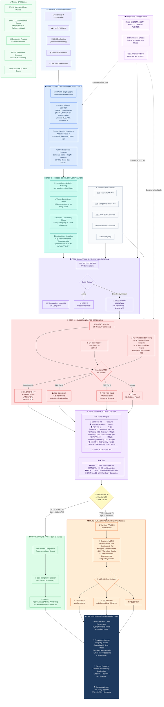

# Global KYC Compliance Agent — Full System Architecture

```mermaid
flowchart TD
    %% ─────────────────────────────────────────────
    %%  INPUTS
    %% ─────────────────────────────────────────────
    subgraph INPUTS["📂 Customer Submits Documents"]
        D1["📄 Certificate of Incorporation"]
        D2["🏠 Proof of Address"]
        D3["👥 UBO Declaration\n(Beneficial Ownership)"]
        D4["💰 Financial Statements"]
        D5["🪪 Director ID Documents"]
    end

    %% ─────────────────────────────────────────────
    %%  STEP 1 — DOCUMENT INTAKE & SECURITY
    %% ─────────────────────────────────────────────
    subgraph S1["🛡️ STEP 1 — DOCUMENT INTAKE & SECURITY"]
        S1A["🔐 SHA-256 Cryptographic\nFingerprint per Document"]
        S1B["🚫 Prompt Injection Detection\n10 attack types blocked\n(Base64, ROT13, role impersonation,\nUnicode RLO, XML breakout...)"]
        S1C["📦 XML Security Quarantine\nAll text isolated in\nunstrusted_document_content tags"]
        S1D["🔍 Structured Field Extraction\nCompany Name · Reg No · Address\nUBO % · Issue Date · Officers"]
    end

    %% ─────────────────────────────────────────────
    %%  STEP 2 — CROSS-DOCUMENT VERIFICATION
    %% ─────────────────────────────────────────────
    subgraph S2["📑 STEP 2 — CROSS-DOCUMENT VERIFICATION"]
        S2A["📐 Levenshtein Similarity Matching\nacross all submitted filings"]
        S2B["✅ Name Consistency Check\nAll docs must agree on entity name"]
        S2C["🏢 Address Consistency Check\nFiling vs Registry vs Proof of Address"]
        S2D["❗ Contradiction Detection\ne.g. Delaware cert vs Texas operating\nagreement = CRITICAL DISCREPANCY"]
    end

    %% ─────────────────────────────────────────────
    %%  STEP 3 — OFFICIAL REGISTRY VERIFICATION
    %% ─────────────────────────────────────────────
    subgraph S3["🏛️ STEP 3 — OFFICIAL REGISTRY VERIFICATION"]
        S3A["🇺🇸 SEC EDGAR API\nUS Corporations"]
        S3B["🇬🇧 Companies House API\nUK Companies"]
        S3C{"Entity Status?"}
        S3D["✅ ACTIVE\nProceed normally"]
        S3E["⚠️ DISSOLVED / UNKNOWN\n+80 Risk Points — ESCALATE"]
    end

    %% ─────────────────────────────────────────────
    %%  STEP 4 — SANCTIONS & PEP SCREENING
    %% ─────────────────────────────────────────────
    subgraph S4["🔴 STEP 4 — SANCTIONS & PEP SCREENING"]
        S4A["🇺🇸 OFAC SDN List\n(US Treasury Sanctions)"]
        S4B["🌐 UN Consolidated Sanctions List\n(Global)"]
        S4C["👔 PEP Database Screening\nTier 1: Heads of State, Ministers\nTier 2: Senior Officials, Judges\nFuzzy Match Threshold: 0.85"]
        S4D{"Sanctions / PEP\nHit Found?"}
        S4E["🔴 SANCTIONS HIT\n+100 Risk Points\nMANDATORY ESCALATION"]
        S4F["🟠 PEP TIER 1 HIT\n+75 Risk Points\nMLRO Review Required"]
        S4G["🟡 PEP TIER 2 HIT\n+40 Risk Points\nAdditional Scrutiny"]
        S4H["🟢 CLEAN\nNo Matches Found"]
    end

    %% ─────────────────────────────────────────────
    %%  STEP 5 — RISK SCORING ENGINE
    %% ─────────────────────────────────────────────
    subgraph S5["📊 STEP 5 — RISK SCORING ENGINE"]
        S5TABLE["Risk Factor Weights\n────────────────────────────\n🔴 Sanctions Hit          +100 pts\n🟠 Dissolved Registry     +80 pts\n🟠 PEP Tier 1             +75 pts\n🟡 Critical Doc Mismatch  +45 pts\n🟡 Missing UBO Disclosure +45 pts\n🟡 Unsupported Jurisdiction +40 pts\n🟡 PEP Tier 2              +40 pts\n🟡 Missing Mandatory Doc   +35 pts\n🟢 Minor Doc Discrepancy  +15 pts\n📌 Fallback Penalty Cap = max 30 pts\n────────────────────────────\n⚖️ FINAL SCORE: 0 – 100"]
        S5TIERS["Risk Tiers\n─────────────────────────────────\n🟢 LOW      0–30    Auto-Approve\n🟡 MEDIUM   31–69   Auto-Approve\n🟠 HIGH     70–89   MLRO Review Required\n🔴 CRITICAL 90–100  Mandatory Escalation"]
    end

    %% ─────────────────────────────────────────────
    %%  DECISION GATE
    %% ─────────────────────────────────────────────
    DECISION{"⚖️ Risk Score ≥ 70\nor Sanctions Hit\nor PEP Tier 1?"}

    %% ─────────────────────────────────────────────
    %%  PATH A — AUTO-APPROVE
    %% ─────────────────────────────────────────────
    subgraph PATHA["🟢 AUTO-APPROVE PATH (~80% of cases)"]
        PA1["📋 Generate Compliance\nRecommendation Report"]
        PA2["📁 Seal Compliance Dossier\nwith Evidence Summary"]
        PA3["✅ Verdict: RECOMMENDATION_APPROVE\nNo human intervention needed"]
    end

    %% ─────────────────────────────────────────────
    %%  PATH B — HUMAN REVIEW (MLRO)
    %% ─────────────────────────────────────────────
    subgraph PATHB["🟠 MLRO HUMAN REVIEW PATH (~20% of cases)"]
        PB1["⏸️ Workflow PAUSES\nat checkpoint"]
        PB2["📨 Structured MLRO Review Packet Sent\n• Risk Score & Tier\n• Flagged Evidence Items\n• PEP / Sanctions Details\n• Cross-Document Discrepancies\n• Regulatory Context"]
        PB3{"👔 MLRO Officer Decision"}
        PB4["✅ APPROVED\nwith Conditions"]
        PB5["🔍 ESCALATED\nto Enhanced Due Diligence"]
        PB6["❌ REJECTED"]
    end

    %% ─────────────────────────────────────────────
    %%  STEP 6 — AUDIT TRAIL
    %% ─────────────────────────────────────────────
    subgraph S6["🔒 STEP 6 — TAMPER-PROOF AUDIT TRAIL"]
        S6A["🔗 SHA-256 Hash Chain\nEvery event cryptographically linked\nto previous event"]
        S6B["📝 Every Action Logged\n• Registry checks\n• Tool calls with Role + Phase\n• Sanctions screen results\n• Human review decisions\n• Timestamps"]
        S6C["🚨 Tamper Detection\nDeletion · Reordering · Duplication\nTruncation · Forgery — ALL detected"]
        S6D["📤 Regulatory Export\nAudit-ready report for\nFCA / FinCEN / Regulator"]
    end

    %% ─────────────────────────────────────────────
    %%  EXTERNAL DATA SOURCES
    %% ─────────────────────────────────────────────
    subgraph EXT["🌐 External Data Sources"]
        E1["🇺🇸 SEC EDGAR API"]
        E2["🇬🇧 Companies House API"]
        E3["🇺🇸 OFAC SDN Database"]
        E4["🌐 UN Sanctions Database"]
        E5["👔 PEP Registry"]
    end

    %% ─────────────────────────────────────────────
    %%  SECURITY & RBAC
    %% ─────────────────────────────────────────────
    subgraph RBAC["🛡️ Role-Based Access Control"]
        R1["Roles: SYSTEM_AGENT · ANALYST · MLRO · AUDITOR"]
        R2["392 Permission Checks\nRole × Tool × Lifecycle Phase"]
        R3["ToolAuthorizationError\nraised on any violation"]
    end

    %% ─────────────────────────────────────────────
    %%  TESTING VALIDATION
    %% ─────────────────────────────────────────────
    subgraph TESTS["✅ Testing & Validation"]
        T1["98 / 98 Automated Tests Passed"]
        T2["1,000 / 1,000 Differential Cases\n0 Mismatches vs Reference Model"]
        T3["50 Concurrent Threads\n0 Race Conditions"]
        T4["45 / 45 Adversarial Scenarios\nBlocked Successfully"]
        T5["392 / 392 RBAC Checks Correct"]
    end

    %% ─────────────────────────────────────────────
    %%  CONNECTIONS
    %% ─────────────────────────────────────────────
    INPUTS --> S1
    S1 --> S2
    S2 --> S3
    S3 --> S3C
    S3C -->|Active| S3D
    S3C -->|Dissolved/Unknown| S3E
    S3D --> S4
    S3E --> S4
    S4 --> S4A & S4B & S4C
    S4A & S4B & S4C --> S4D
    S4D -->|Sanctions Hit| S4E
    S4D -->|PEP Tier 1| S4F
    S4D -->|PEP Tier 2| S4G
    S4D -->|Clean| S4H
    S4E & S4F & S4G & S4H --> S5
    S5 --> DECISION

    DECISION -->|"NO — Score < 70\nLow / Medium Risk"| PATHA
    DECISION -->|"YES — Score ≥ 70\nHigh / Critical Risk"| PATHB

    PA1 --> PA2 --> PA3
    PB1 --> PB2 --> PB3
    PB3 --> PB4 & PB5 & PB6

    PA3 --> S6
    PB4 & PB5 & PB6 --> S6

    EXT --> S3
    EXT --> S4

    RBAC -.->|Governs all tool calls| S1
    RBAC -.->|Governs all tool calls| S3
    RBAC -.->|Governs all tool calls| S4

    %% ─────────────────────────────────────────────
    %%  STYLES
    %% ─────────────────────────────────────────────
    classDef inputStyle fill:#EFF6FF,stroke:#3B82F6,color:#1E3A5F
    classDef step1Style fill:#DBEAFE,stroke:#2563EB,color:#1E3A5F
    classDef step2Style fill:#CCFBF1,stroke:#0D9488,color:#134E4A
    classDef step3Style fill:#EDE9FE,stroke:#7C3AED,color:#2E1065
    classDef step4Style fill:#FEE2E2,stroke:#DC2626,color:#450A0A
    classDef step5Style fill:#F3E8FF,stroke:#9333EA,color:#2E1065
    classDef decisionStyle fill:#FEF9C3,stroke:#CA8A04,color:#1C1917
    classDef approveStyle fill:#DCFCE7,stroke:#16A34A,color:#14532D
    classDef reviewStyle fill:#FFEDD5,stroke:#EA580C,color:#431407
    classDef auditStyle fill:#1E3A5F,stroke:#1E3A5F,color:#FFFFFF
    classDef extStyle fill:#F8FAFC,stroke:#94A3B8,color:#334155
    classDef rbacStyle fill:#FDF4FF,stroke:#A855F7,color:#2E1065
    classDef testStyle fill:#F0FDF4,stroke:#22C55E,color:#14532D

    class INPUTS inputStyle
    class S1,S1A,S1B,S1C,S1D step1Style
    class S2,S2A,S2B,S2C,S2D step2Style
    class S3,S3A,S3B,S3C,S3D,S3E step3Style
    class S4,S4A,S4B,S4C,S4D,S4E,S4F,S4G,S4H step4Style
    class S5,S5TABLE,S5TIERS step5Style
    class DECISION decisionStyle
    class PATHA,PA1,PA2,PA3 approveStyle
    class PATHB,PB1,PB2,PB3,PB4,PB5,PB6 reviewStyle
    class S6,S6A,S6B,S6C,S6D auditStyle
    class EXT,E1,E2,E3,E4,E5 extStyle
    class RBAC,R1,R2,R3 rbacStyle
    class TESTS,T1,T2,T3,T4,T5 testStyle
```
